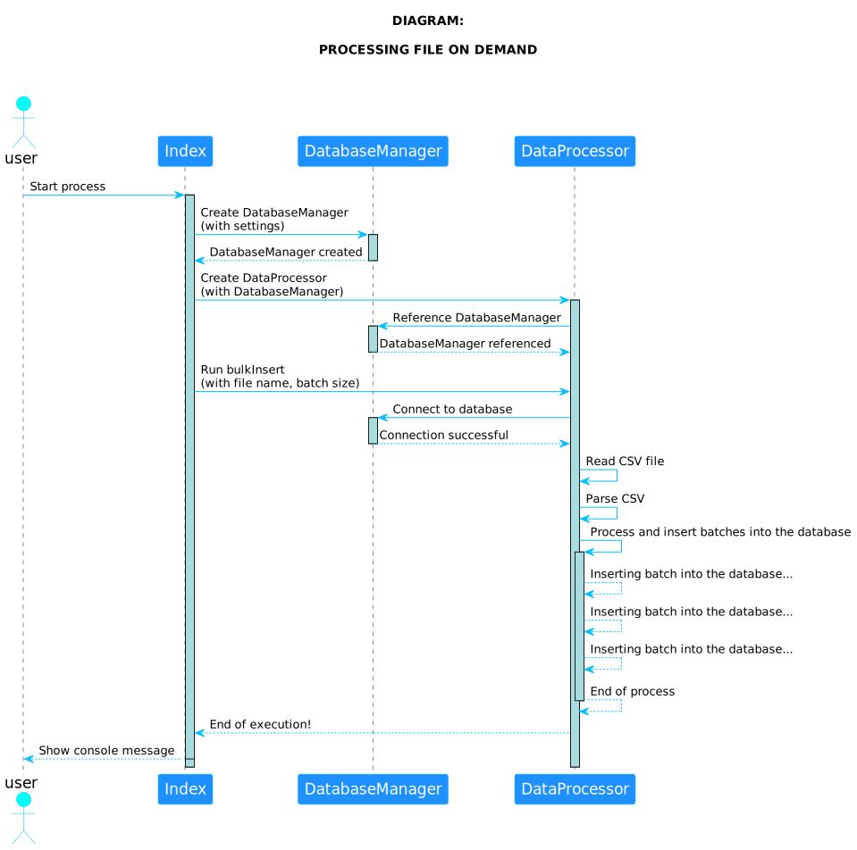

## ON-DEMAND ARCHIVE PROCESS

This project demonstrates an example of a Node.js application, aiming to apply the power of Node.js stream and pipeline data processing to efficiently process large datasets in batches, minimizing memory consumption. It reads a CSV file in chunks using streams, parses the data with the '@fast-csv/parse' package, and processes it in batches before inserting it into the MySQL database. Using streams and pipelines allows more efficient and scalable execution, especially when dealing with large volumes of data.

## Keywords
*Keywords*: Node.js, Stream, Pipeline, Batch File Insert, Performance, Scalability, Memory, Data processing, MySQL

**Overall, the code performs the following steps**:
  * Establishes the connection to the MySQL database.
  * Reads a CSV file.
  * Processes CSV data in batches.
  * Inserts batches of data into the database.
  * Finalizes execution, dealing with errors and ending the process.

    

    
#### 1. Requirements Installation

##### 1.1. Installed on your host
* Install docker *26.0.2*
* Install docker-compose *1.29.2**
* Install Makefile *4.3*

##### 1.1. Installed with docker image
* NodeJs *20.9*
* MySql *8.0.28*

#### 2. Steps to run this project

##### 2.1. Start project in mode development

To start project using docker use the commands

| COMMAND      | DESCRIPTION                     |
|--------------|---------------------------------|
| make install | Installing dependencies project |
| make mysql   | Execute container mysql         |
| make start   | Execute application             |
