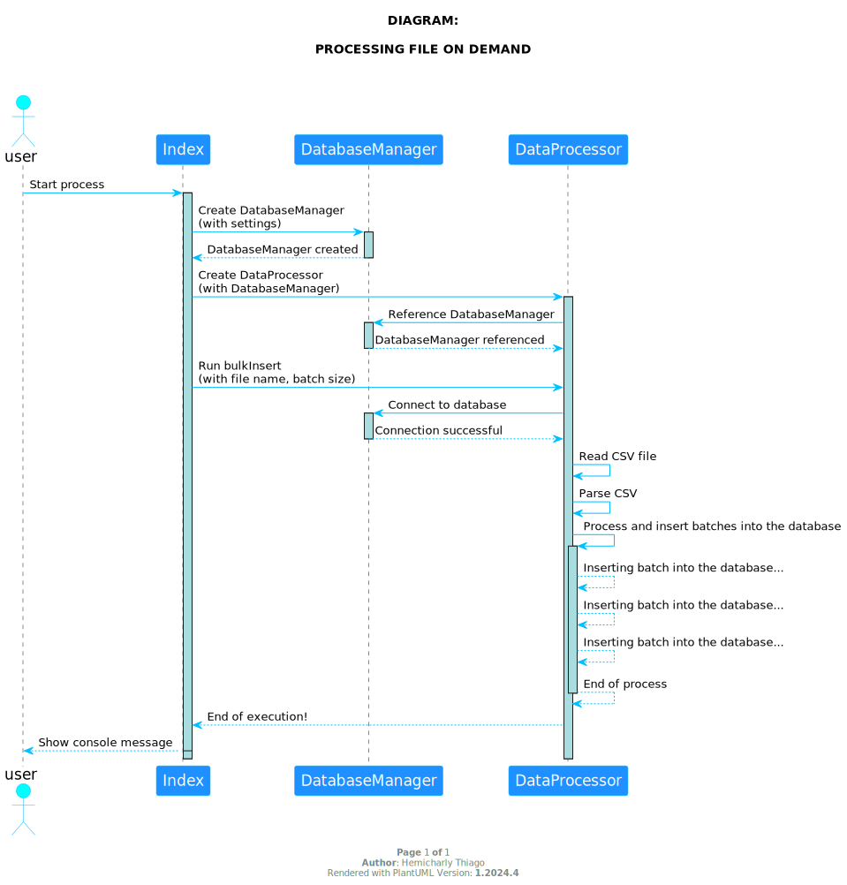

## ON-DEMAND ARCHIVE PROCESS


This project demonstrates an example Node.js application, with the goal of applying the power of Node.js flow and
pipeline in data processing, aiming to efficiently process large data sets in batches, minimizing memory consumption. It
reads a CSV file into chunks using streams, parses the csv data and batch processes it before inserting in the MySQL
database. The use of streams and pipelines allows for more efficient and scalable execution, especially when
deal with large volumes of data.

### Keywords

*Keywords*: Node.js, Stream, Pipeline, Batch File Insert, Performance, Scalability, Memory, Data processing, MySQL.

**Overall, the code performs the following steps**:

* Establishes the connection to the MySQL database.
* Reads a CSV file.
* Processes CSV data in batches.
* Inserts batches of data into the database.
* Finalizes execution, dealing with errors and ending the process.

#### SYSTEM DESIGN DIAGRAM

<div style="text-align: center;">
    
</div>

#### SEQUENCE DIAGRAM

<div style="text-align: center;">
    
</div>

#### 1. Requirements Installation

##### 1.1. Installed on your host

* Install docker *26.0.2*
* Install docker-compose *1.29.2**
* Install Makefile *4.3*

##### 1.1. Installed with docker image

* NodeJs *20.9*
* MySql *8.0.28*

#### 2. Steps to run this project

##### 2.1. Start MySQL docker container

 ```bash
 make mysql
 ```

##### 2.2. Installing project dependencies

 ```bash
 make install
 ```

##### 2.3. Run application

 ```bash
 make start
 ```
